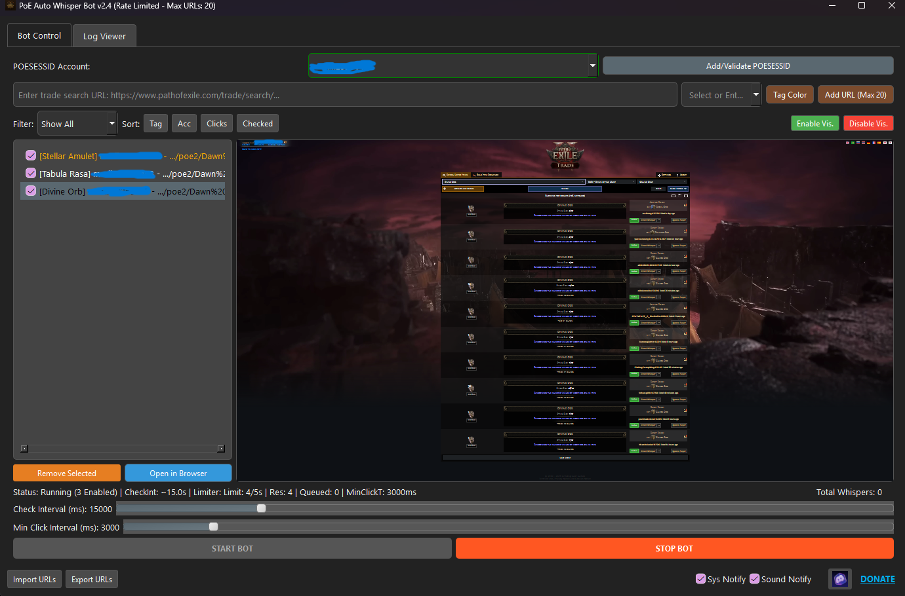

# PoE Auto Whisper Bot v2.4

*Screenshot of the main bot interface.*

This tool automatically monitors your Path of Exile trade searches and attempts to click the "Whisper" or "Direct Whisper" button for newly listed items, helping you contact sellers faster.

---

## ⚠️ IMPORTANT: READ BEFORE DOWNLOADING ⚠️

*   **USE AT YOUR OWN RISK:** Using automation tools, including this bot, is **strictly against Path of Exile's Terms of Service**. Using this tool carries a **significant risk of account suspension or permanent ban**. The creator of this tool is **not responsible** for any actions taken against your Path of Exile account. By downloading and using this software, you acknowledge and accept this risk.
*   **Rate Limiting is Not Foolproof:** While the bot implements rate limiting, GGG can change limits or detection methods anytime. **Aggressive settings WILL likely lead to issues.** Start with very conservative settings (Check Interval: 15000ms+, Min Click Interval: 3000ms+).
*   **No Guarantees:** The bot offers no guarantee of acquiring items or being the first to whisper. Website changes can break functionality.

---

## Download

**➡️ [Download the latest release HERE](https://github.com/merlin293/PoE2-Live-Search-Sniper/releases/latest) ⬅️**
*(Requires Windows x64. Download the `.zip` file attached to the latest release.)*

---

## Key Features:

*   **Automated Whispering:** Watches active trade search tabs for new results and clicks the first available whisper button.
*   **Multiple URL Support:** Monitor up to 20 different trade searches simultaneously.
*   **Multi-Account POESESSID:** Manage and use different POESESSIDs for various accounts. Includes a validator to check if your session ID is active.
*   **Sophisticated Rate Limiting:**
    *   *Dynamic Limit Detection:* Attempts to fetch official rate limits from GGG's headers on startup.
    *   *Reservoir System:* Manages requests based on detected limits (e.g., X requests per Y seconds).
    *   *Configurable Minimum Click Interval:* Set a mandatory delay (in milliseconds) between consecutive whisper clicks, enforced by the bot, adding a crucial layer of safety.
    *   *Status Feedback:* Displays the current rate limiter status (limits, reservoir, queued tasks, min click interval).
*   **URL Management:**
    *   Add, remove, and tag URLs with custom names and colors.
    *   Filter the URL list by tag.
    *   Sort URLs by tag, account, clicks, or last checked time.
    *   Enable/Disable individual URLs easily via checkboxes.
    *   Bulk enable/disable visible URLs.
*   **Notifications:** Optional system tray popups and sound alerts upon successful whispers.
*   **Customizable Intervals:**
    *   *Check Interval:* Control how often the bot cycles through your enabled URLs to look for changes (higher is generally safer).
    *   *Min Click Interval:* Control the minimum time enforced between whisper attempts (higher is significantly safer).
*   **Persistence:** Saves your URLs, POESESSIDs, tags, colors, click counts, and interval settings between sessions (`poe_bot_data.json`). **This file is stored next to the executable.**
*   **Import/Export:** Easily backup or share your list of URLs via JSON files.
*   **Visual Feedback:** See the actual web pages being monitored (zoomed out) and view URL status (Loading, Loaded, Queued, Rate Limited, Error, etc.).
*   **Log Viewer:** Built-in tab to view detailed operational logs and errors (`error.log`). **This file is stored next to the executable.**
*   **Standalone Executable:** Packaged for ease of use without requiring manual Python or library installation.

---

## Installation & Setup

1.  Download the bot using the link provided in the [Download](#download) section above.
2.  Unzip the downloaded file (e.g., `PoEWhisperBot_v2.4.zip`) into a folder where you want to keep the bot.
3.  Run the `poe_whisper_bot.exe` executable inside the unzipped folder. **Your antivirus might flag it (false positive); you may need to add an exception.**
4.  **First Run:**
    *   The bot needs a valid POESESSID to interact with the trade site. Log into the Path of Exile website in your web browser, then find your POESESSID cookie value (search online for "how to find POESESSID path of exile" if unsure).
    *   Click the "Add/Validate POESESSID" button in the bot and paste your copied POESESSID value. Give it a nickname (e.g., your account name).
    *   Add your trade search URLs (e.g., `https://www.pathofexile.com/trade2/search/poe2/.../live`) using the input fields and assign tags.
    *   **Crucially, review the interval sliders:**
        *   **Check Interval:** Start at `15000` (15 seconds) or higher.
        *   **Min Click Interval:** Start at `3000` (3 seconds) or higher. **Lowering these significantly increases risk.**
5.  Enable the URLs you want to monitor using the checkboxes in the list.
6.  Click the **START BOT** button.
7.  Your settings (`poe_bot_data.json`) and logs (`error.log`) will be saved in the same folder as the `.exe`. Check `error.log` if you encounter problems.

---

## Troubleshooting

*   **Bot doesn't start / Crashes immediately:** Check the `error.log` file created next to the `.exe` for error messages.
*   **Antivirus flags the `.exe`:** This is common for tools like this (false positive). You likely need to add an exception for the `poe_whisper_bot.exe` file or the folder it's in within your antivirus software settings.
*   **"CRITICAL Rate Limited (429)" status:** You've been rate-limited by GGG. **Stop the bot immediately.** Wait a significant amount of time (minutes or even hours) before trying again. You MUST increase your interval settings (both Check Interval and Min Click Interval) to be less aggressive. If it persists after using very high intervals, your IP or account might be temporarily flagged by GGG.
*   **"Login Required" status on a URL:** Your POESESSID for the associated account has expired. Re-validate it: select the account in the dropdown, click "Add/Validate POESESSID", and paste the *same* (or a new) valid POESESSID.
*   **Bot doesn't click whispers:**
    *   Ensure the correct URLs are added and *enabled* (checkbox checked).
    *   Ensure the POESESSID associated with the URL is valid ("Login Required" status means it's not).
    *   Check the `error.log` for any JavaScript errors or other messages.
    *   GGG might have updated the trade website structure, breaking the button-finding logic. Check if there's a newer version of the bot.

---

*Disclaimer: This tool is for educational purposes and convenience. Use responsibly and be fully aware of the risks associated with violating Path of Exile's Terms of Service.*
